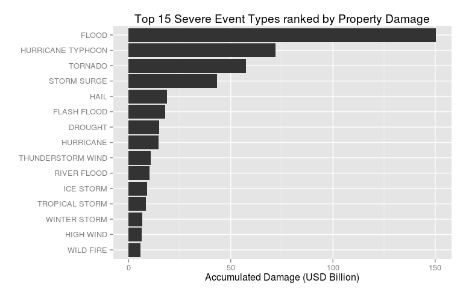

# Exploring Health and Economic impact of severe weather events
24 August 2014  

### Synopsis
Using the U.S.A. National Oceanic and Atmospheric Administration's (NOAA) [Storm Data](https://d396qusza40orc.cloudfront.net/repdata%2Fdata%2FStormData.csv.bz2) spanning 1950 through November 2011 this report endeavours to address the following two questions:

- Which types of events are most harmful with respect to population health?
- Which types of events have the greatest economic consequences?

We start by reading the raw data from NOAA's [Storm Data](https://d396qusza40orc.cloudfront.net/repdata%2Fdata%2FStormData.csv.bz2) followed by a fair amount of text manipulation to the `EVTYPE` (Event Types) field. Next we aggregate the Health and Economic per severe weather event type over the span of our dataset. We then find the top Health and Economic severe weather event types. In conclusion, we report our findings using a combinations of plots and tables.

### Data Dictionary
The NOAA Storm Data consists of 902,297 observations containing, among other, the following fields. For a full description of the data definition please refer to the NOAA [Storm Data Documentation]("https://d396qusza40orc.cloudfront.net/repdata%2Fpeer2_doc%2Fpd01016005curr.pdf").

Field | Definition
----- | ----- 
`EVTYPE` | Event Type
`FATALITIES` | Number of Fatalities
`INJURIES` | Number of Injuries
`PROPDMG` | USD Property Damage 
`PROPDMGEXP` | USD Propery Damage Magnitude (H = hundreds, K = thousands, M = millions, B = billions)
`CROPDMG` | USD Crop Damage 
`CROPDMGEXP` | USD Crop Damage Magnitude (H = hundreds, K = thousands, M = millions, B = billions)

### Data Processing
Start by initializing a few R libraries. Turn echo on for R code chunks, center figures and suppress messages.

```r
require(gdata)
require(lattice)
require(knitr)
require(plyr)
require(reshape2)
require(xtable)
opts_chunk$set(echo=TRUE, fig.align='center', message=FALSE, cache=TRUE)
```

Check to see if we've already downloaded the file, if not, download it now. 

```r
filename <- 'data/StormData.csv.bz2'
dir.create(file.path(getwd(), 'data'), showWarnings = FALSE)
if (!file.exists(filename))
{
  download.file(
    "https://d396qusza40orc.cloudfront.net/repdata%2Fdata%2FStormData.csv.bz2", 
    filename, 
    method="curl")
}
```

Create a function to calculate damage using the Damage Magnitude (H = hunderds, K = thousands, M = millions, B = billions) scale.

```r
CalculateDamage <- function(dmg, exp){
  if (exp == 'H') { dmg * 10^2 }  
  else if (exp == 'K') { dmg * 10^3 }
  else if (exp == 'M') { dmg * 10^6 }
  else if (exp == 'B') { dmg * 10^9 }
  else { dmg }
}
```

Read data from `StormData.csv.bz2` into `dataRaw` and then proceed to ready `data` by converting columns to the right data types and lastly calculate `DMG` (damage total) using `CalculateDamage()`.

```r
if (!exists("dataRaw")){
  dataRaw <- read.csv(bzfile(filename))
  
  data <- dataRaw[ ,c('EVTYPE', 'FATALITIES', 'INJURIES', 'PROPDMG', 'PROPDMGEXP', 'CROPDMG', 'CROPDMGEXP')]
  data$EVTYPE <- toupper(data$EVTYPE)
  data$FATALITIES > as.numeric(as.character(data$FATALITIES))
  data$INJURIES > as.numeric(as.character(data$INJURIES))
  data$PROPDMG > as.numeric(as.character(data$PROPDMG))
  data$CROPDMG > as.numeric(as.character(data$CROPDMG))
  data$PROPDMGEXP <- toupper(data$PROPDMGEXP) 
  data$CROPDMGEXP <- toupper(data$CROPDMGEXP)  
  
  data <- data[data$FATALITIES > 0 |data$INJURIES > 0 |
                 data$PROPDMG > 0 | data$CROPDMG > 0, ]
  
  data <- cbind(data, DMG = 
                  mapply(CalculateDamage, data$PROPDMG, data$PROPDMGEXP) +
                  mapply(CalculateDamage, data$CROPDMG, data$CROPDMGEXP))
}
```

The `EVTYPE` (Event Types) seems to have been populated by hand and as a result suffers from a great deal of finger trouble, spelling mistakes and inconsistent logging. Create two functions to clean up `EVTYPE` (Event Types).


```r
EventTypeCleanupStartsWith <- function(eventType){
  if (startsWith(eventType, "THUNDERSTORM WIND")){
    if (eventType != "THUNDERSTORM WIND FLOOD" |
          eventType != "THUNDERSTORM WIND HAIL" |
          eventType != "THUNDERSTORM WIND LIGHTNING" |
          eventType != "THUNDERSTORM WIND FUNNEL CLOU" |
          eventType != "THUNDERSTORM WIND LIGHTNING" |
          eventType != "THUNDERSTORM WIND TREE") {
      eventType <- "THUNDERSTORM WIND"
    }
  }
  
  if (startsWith(eventType, "TROPICAL STORM")){
    eventType <- "TROPICAL STORM"
  }
  
  return(eventType)
}

EventTypeCleanup <- function(data) {
  # Remove unwanted chars 
  data$EVTYPE <- gsub("[(]", " ", data$EVTYPE)
  data$EVTYPE <- gsub("[)]", " ", data$EVTYPE)
  data$EVTYPE <- gsub("[&]", " ", data$EVTYPE)
  data$EVTYPE <- gsub("[,]", " ", data$EVTYPE)
  data$EVTYPE <- gsub("[-]", " ", data$EVTYPE)
  data$EVTYPE <- gsub("[/]", " ", data$EVTYPE)
  data$EVTYPE <- gsub("[\\]", " ", data$EVTYPE)
  data$EVTYPE <- gsub("AND", " ", data$EVTYPE)
  
  # Drop Suffix
  data$EVTYPE <- gsub(" DAMAGE$", "", data$EVTYPE)
  data$EVTYPE <- gsub(" DAMAGE TO$", "", data$EVTYPE)
  data$EVTYPE <- gsub("MINOR$", "", data$EVTYPE)
  data$EVTYPE <- gsub("G40", "", data$EVTYPE)
  data$EVTYPE <- gsub("48", "", data$EVTYPE)
  
  # De-pluralize
  data$EVTYPE <- gsub("FIRE", " FIRE", data$EVTYPE)
  data$EVTYPE <- gsub("FIRES", " FIRE", data$EVTYPE)
  data$EVTYPE <- gsub("FLOOD", " FLOOD", data$EVTYPE)
  data$EVTYPE <- gsub("FLOODING", " FLOOD", data$EVTYPE)
  data$EVTYPE <- gsub("FLOODS", " FLOOD", data$EVTYPE)
  data$EVTYPE <- gsub("SLIDE", " SLIDE", data$EVTYPE)
  data$EVTYPE <- gsub("SLIDES", " SLIDE", data$EVTYPE)
  data$EVTYPE <- gsub("STORM", " STORM", data$EVTYPE)
  data$EVTYPE <- gsub("STORMS", " STORM", data$EVTYPE)
  data$EVTYPE <- gsub("SQUALLS", "SQUALL", data$EVTYPE)
  data$EVTYPE <- gsub("TREES", "TREE", data$EVTYPE)
  data$EVTYPE <- gsub("TORNADOES", "TORNADO", data$EVTYPE)
  data$EVTYPE <- gsub("WINS", " WIND", data$EVTYPE)
  data$EVTYPE <- gsub("WINDS", " WIND", data$EVTYPE)
  data$EVTYPE <- gsub("WINDHAIL", "WIND HAIL", data$EVTYPE)
  data$EVTYPE <- gsub("CURRENTS", "CURRENTS", data$EVTYPE)
  
  # Reference
  data$EVTYPE <- gsub("UNSEASONABLE", "UNSEASONABLY", data$EVTYPE)
  
  # HAIL Numbers
  data$EVTYPE <- gsub(" 0.75$", " 075", data$EVTYPE)
  data$EVTYPE <- gsub(" 75$", " 075", data$EVTYPE)
  
  # Address some spelling / type issues
  data$EVTYPE <- gsub("THUNER", "THUNDER", data$EVTYPE)
  data$EVTYPE <- gsub("THUDER", "THUNDER", data$EVTYPE)
  data$EVTYPE <- gsub("TUNDER", "THUNDER", data$EVTYPE)
  data$EVTYPE <- gsub("THUNDER", "THUNDER", data$EVTYPE)
  data$EVTYPE <- gsub("THUNDEER", "THUNDER", data$EVTYPE)
  data$EVTYPE <- gsub("THUNDERE", "THUNDER", data$EVTYPE)
  data$EVTYPE <- gsub("THUNDER", "THUNDER", data$EVTYPE)
  data$EVTYPE <- gsub("THUNDERTORM", "THUNDERSTORM", data$EVTYPE)
  data$EVTYPE <- gsub("TSTMW", "THUNDERSTORM WIND", data$EVTYPE)
  data$EVTYPE <- gsub("TSTM", "THUNDERSTORM", data$EVTYPE)
  data$EVTYPE <- gsub("THUNDER STORMW", "THUNDERSTORM WIND", data$EVTYPE)
  data$EVTYPE <- gsub("THUNDERSNOW", "THUNDER SNOW", data$EVTYPE)
  data$EVTYPE <- gsub("TORNDAO", "TORNADO", data$EVTYPE)
  data$EVTYPE <- gsub("THUNDERSTROM", "THUNDERSTORM", data$EVTYPE)
  data$EVTYPE <- gsub("THUNDERSTORM", "THUNDERSTORM", data$EVTYPE)
  data$EVTYPE <- gsub("THUNDER STORMW", "THUNDERSTORM WIND", data$EVTYPE)
  data$EVTYPE <- gsub("THUNDER STORM", "THUNDERSTORM", data$EVTYPE)
  
  # Clean Up spaces
  data$EVTYPE <- gsub("  ", " ", data$EVTYPE)
  data$EVTYPE <- gsub("  ", " ", data$EVTYPE)
  data$EVTYPE <- gsub("  ", " ", data$EVTYPE)
  data$EVTYPE <- gsub("  ", " ", data$EVTYPE)
  data$EVTYPE <- gsub("^\\s+|\\s+$", "", data$EVTYPE)
  
  # Clean up a few Starts With
  data$EVTYPE <- mapply(EventTypeCleanupStartsWith, data$EVTYPE)
  
  # Final Thunderstorm
  data$EVTYPE <- gsub("THUNDER STORM", "THUNDERSTORM", data$EVTYPE)
  
  return(data)
}
```


Create a data frame `dataHltSum` as a summary related to health (fatalities and injuries). Use the `EventTypeCleanup()` function to clean up `EVTYPE` and then aggregate again. Ranking the `EVTYPE` from a health perspective is tricky because just adding `FATALITIES` and `INJURIES` together does not make sense from a social perspective. It is clear that a fatality is more severe than an injury. But how much? For the purposes of this report we assume 10 times.

```r
dataHlt <- data[data$FATALITIES > 0 | data$INJURIES > 0, c('EVTYPE', 'FATALITIES', 'INJURIES')]
dataHltSum <- ddply(dataHlt, .(EVTYPE), colwise(sum))
dataHltSum <- EventTypeCleanup(dataHltSum)
dataHltSum <- ddply(dataHltSum, .(EVTYPE), colwise(sum))

dataHltSum <- cbind(dataHltSum, 
                    TOTAL=dataHltSum$FATALITIES + dataHltSum$INJURIES,
                    TOTAL_ADJUSTED=dataHltSum$FATALITIES + (dataHltSum$INJURIES/10))

dataHltSum <- dataHltSum[with(dataHltSum, order(-TOTAL_ADJUSTED)), ]
dataHltSum <- dataHltSum[1:20,] 
```

Create a data frame `dataDmgSum` as a summary related to property damage. Use the `EventTypeCleanup()` function to clean up `EVTYPE` and then aggregate again. Order by DMG (damage) descending and select the 20 most servere weather events.

```r
dataDmg <- data[data$DMG > 0 , c('EVTYPE','DMG')]
dataDmgSum <- ddply(dataDmg, .(EVTYPE), colwise(sum))
dataDmgSum <- EventTypeCleanup(dataDmgSum)
dataDmgSum <- ddply(dataDmgSum, .(EVTYPE), colwise(sum))
dataDmgSum <- dataDmgSum[with(dataDmgSum, order(-DMG)), ]
dataDmgSum <- dataDmgSum[1:20,] 
dataDmgSum$DMG <- dataDmgSum$DMG / 10^9
```


### Results
#### Which types of events are most harmful with respect to population health?
Print the 20 most severe Event Types from a Public Health perspective using `xtable()`. Order the list descending by `TOTAL_ADJUSTED` which is calculated as `FATALITIES` + (`INJURIES`/10) in an effort to convey a weighed public health harm attributed to the respective event types. 

```r
dataHltSum$FATALITIES <- format(dataHltSum$FATALITIES, big.mark=',')
dataHltSum$INJURIES <- format(dataHltSum$INJURIES, big.mark=',')
dataHltSum$TOTAL <- format(dataHltSum$TOTAL, big.mark=',')
dataHltSum$TOTAL_ADJUSTED <- format(dataHltSum$TOTAL_ADJUSTED, big.mark=',')
colnames(dataHltSum) <- c(
  'Event Type', 'Fatalities', 'Injuries', 
  'Fatalities + Injuries', 'Fatalities + Injuries (Weighted)')
print(xtable(dataHltSum), type='HTML', html.table.attributes="align='center', border='1px'", include.rownames=FALSE)
```

<!-- html table generated in R 3.0.2 by xtable 1.7-3 package -->
<!-- Tue Aug 26 09:14:12 2014 -->
<TABLE align='center', border='1px'>
<TR> <TH> Event Type </TH> <TH> Fatalities </TH> <TH> Injuries </TH> <TH> Fatalities + Injuries </TH> <TH> Fatalities + Injuries (Weighted) </TH>  </TR>
  <TR> <TD> TORNADO </TD> <TD> 5,633 </TD> <TD> 91,346 </TD> <TD> 96,979 </TD> <TD> 14,767.6 </TD> </TR>
  <TR> <TD> EXCESSIVE HEAT </TD> <TD> 1,903 </TD> <TD>  6,525 </TD> <TD>  8,428 </TD> <TD>  2,555.5 </TD> </TR>
  <TR> <TD> THUNDERSTORM WIND </TD> <TD>   710 </TD> <TD>  9,496 </TD> <TD> 10,206 </TD> <TD>  1,659.6 </TD> </TR>
  <TR> <TD> LIGHTNING </TD> <TD>   816 </TD> <TD>  5,230 </TD> <TD>  6,046 </TD> <TD>  1,339.0 </TD> </TR>
  <TR> <TD> FLASH FLOOD </TD> <TD>   999 </TD> <TD>  1,785 </TD> <TD>  2,784 </TD> <TD>  1,177.5 </TD> </TR>
  <TR> <TD> FLOOD </TD> <TD>   476 </TD> <TD>  6,791 </TD> <TD>  7,267 </TD> <TD>  1,155.1 </TD> </TR>
  <TR> <TD> HEAT </TD> <TD>   937 </TD> <TD>  2,100 </TD> <TD>  3,037 </TD> <TD>  1,147.0 </TD> </TR>
  <TR> <TD> HIGH WIND </TD> <TD>   283 </TD> <TD>  1,440 </TD> <TD>  1,723 </TD> <TD>    427.0 </TD> </TR>
  <TR> <TD> RIP CURRENT </TD> <TD>   368 </TD> <TD>    232 </TD> <TD>    600 </TD> <TD>    391.2 </TD> </TR>
  <TR> <TD> WINTER STORM </TD> <TD>   216 </TD> <TD>  1,338 </TD> <TD>  1,554 </TD> <TD>    349.8 </TD> </TR>
  <TR> <TD> ICE STORM </TD> <TD>    89 </TD> <TD>  1,975 </TD> <TD>  2,064 </TD> <TD>    286.5 </TD> </TR>
  <TR> <TD> AVALANCHE </TD> <TD>   224 </TD> <TD>    170 </TD> <TD>    394 </TD> <TD>    241.0 </TD> </TR>
  <TR> <TD> RIP CURRENTS </TD> <TD>   204 </TD> <TD>    297 </TD> <TD>    501 </TD> <TD>    233.7 </TD> </TR>
  <TR> <TD> HEAVY SNOW </TD> <TD>   127 </TD> <TD>  1,021 </TD> <TD>  1,148 </TD> <TD>    229.1 </TD> </TR>
  <TR> <TD> HEAT WAVE </TD> <TD>   172 </TD> <TD>    379 </TD> <TD>    551 </TD> <TD>    209.9 </TD> </TR>
  <TR> <TD> HURRICANE TYPHOON </TD> <TD>    64 </TD> <TD>  1,275 </TD> <TD>  1,339 </TD> <TD>    191.5 </TD> </TR>
  <TR> <TD> EXTREME COLD </TD> <TD>   162 </TD> <TD>    231 </TD> <TD>    393 </TD> <TD>    185.1 </TD> </TR>
  <TR> <TD> WILD FIRE </TD> <TD>    78 </TD> <TD>  1,061 </TD> <TD>  1,139 </TD> <TD>    184.1 </TD> </TR>
  <TR> <TD> BLIZZARD </TD> <TD>   101 </TD> <TD>    805 </TD> <TD>    906 </TD> <TD>    181.5 </TD> </TR>
  <TR> <TD> HAIL </TD> <TD>    15 </TD> <TD>  1,361 </TD> <TD>  1,376 </TD> <TD>    151.1 </TD> </TR>
   </TABLE>
</br>

#### Which types of events have the greatest economic consequences?
Create a bar chart showing the 20 most severe Event Types from a Property Damage perspective.

```r
dataDmgSum$EVTYPE <- reorder(dataDmgSum$EVTYPE, -dataDmgSum$DMG) 
print(barchart(EVTYPE ~ DMG, 
               data=dataDmgSum[1:15,], 
               xlim=c(0,155),
               xlab="Damage caused in USD Billion (10^9) between 1950 and November 2011",
               main="Top 15 Severe Event Types from a Property Damage perspective"
               ))
```



Print the 20 most severe Event Types from a Property Damage perspective using `xtable()`. DMG (damage) is shown in Billion (10^9) USD

```r
dataDmgSum$DMG <- format(dataDmgSum$DMG, big.mark=',')
colnames(dataDmgSum) <- c('Event Type', 'Damage in USD Billion (10^9)')

print(xtable(dataDmgSum), type='HTML', html.table.attributes="align='center', border='1px'", include.rownames=FALSE)
```

<!-- html table generated in R 3.0.2 by xtable 1.7-3 package -->
<!-- Tue Aug 26 09:16:57 2014 -->
<TABLE align='center', border='1px'>
<TR> <TH> Event Type </TH> <TH> Damage in USD Billion (10^9) </TH>  </TR>
  <TR> <TD> FLOOD </TD> <TD> 150.443 </TD> </TR>
  <TR> <TD> HURRICANE TYPHOON </TD> <TD>  71.914 </TD> </TR>
  <TR> <TD> TORNADO </TD> <TD>  57.352 </TD> </TR>
  <TR> <TD> STORM SURGE </TD> <TD>  43.324 </TD> </TR>
  <TR> <TD> HAIL </TD> <TD>  18.758 </TD> </TR>
  <TR> <TD> FLASH FLOOD </TD> <TD>  17.894 </TD> </TR>
  <TR> <TD> DROUGHT </TD> <TD>  15.019 </TD> </TR>
  <TR> <TD> HURRICANE </TD> <TD>  14.610 </TD> </TR>
  <TR> <TD> THUNDERSTORM WIND </TD> <TD>  10.986 </TD> </TR>
  <TR> <TD> RIVER FLOOD </TD> <TD>  10.293 </TD> </TR>
  <TR> <TD> ICE STORM </TD> <TD>   8.967 </TD> </TR>
  <TR> <TD> TROPICAL STORM </TD> <TD>   8.409 </TD> </TR>
  <TR> <TD> WINTER STORM </TD> <TD>   6.716 </TD> </TR>
  <TR> <TD> HIGH WIND </TD> <TD>   6.559 </TD> </TR>
  <TR> <TD> WILD FIRE </TD> <TD>   5.786 </TD> </TR>
  <TR> <TD> STORM SURGE TIDE </TD> <TD>   4.642 </TD> </TR>
  <TR> <TD> HURRICANE OPAL </TD> <TD>   3.192 </TD> </TR>
  <TR> <TD> WILD FOREST FIRE </TD> <TD>   3.109 </TD> </TR>
  <TR> <TD> HEAVY RAIN SEVERE WEATHER </TD> <TD>   2.500 </TD> </TR>
  <TR> <TD> TORNADO THUNDERSTORM WIND HAIL </TD> <TD>   1.603 </TD> </TR>
   </TABLE>
</br>
